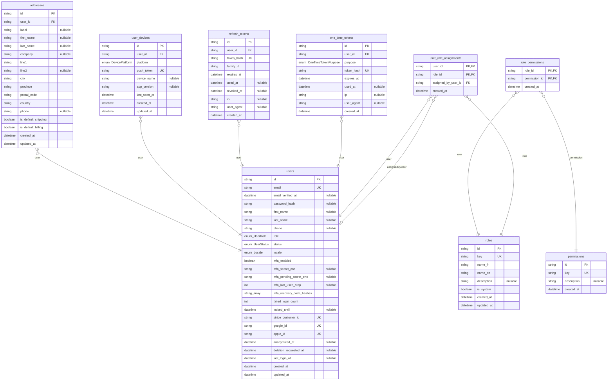
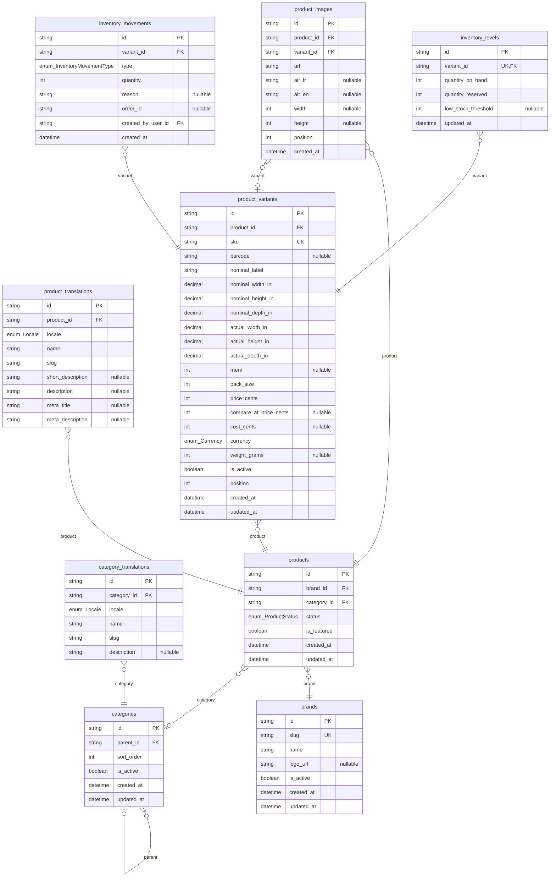
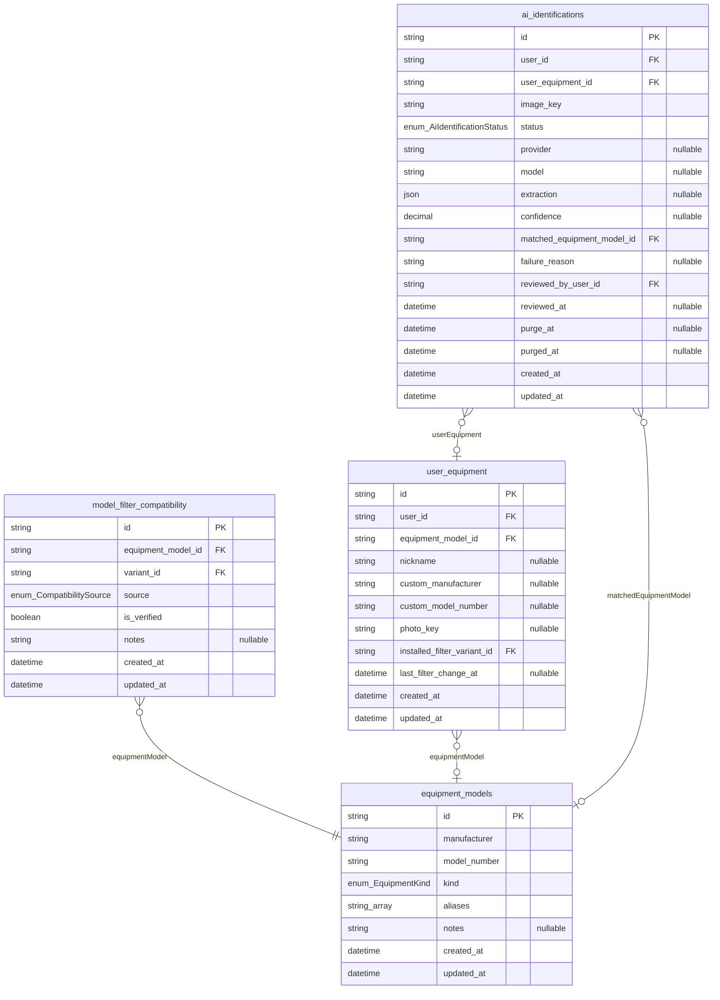
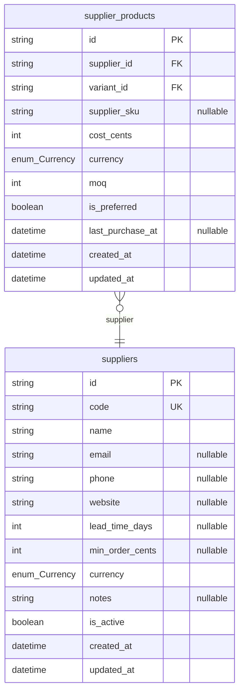
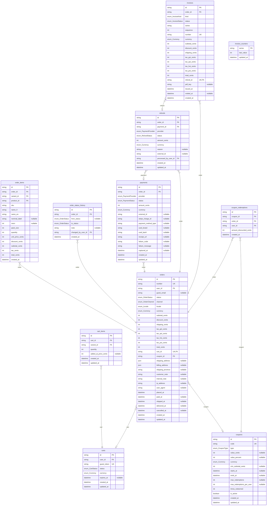
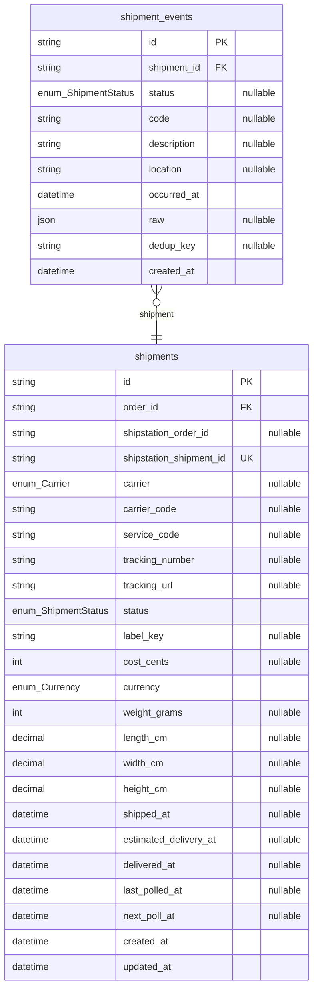
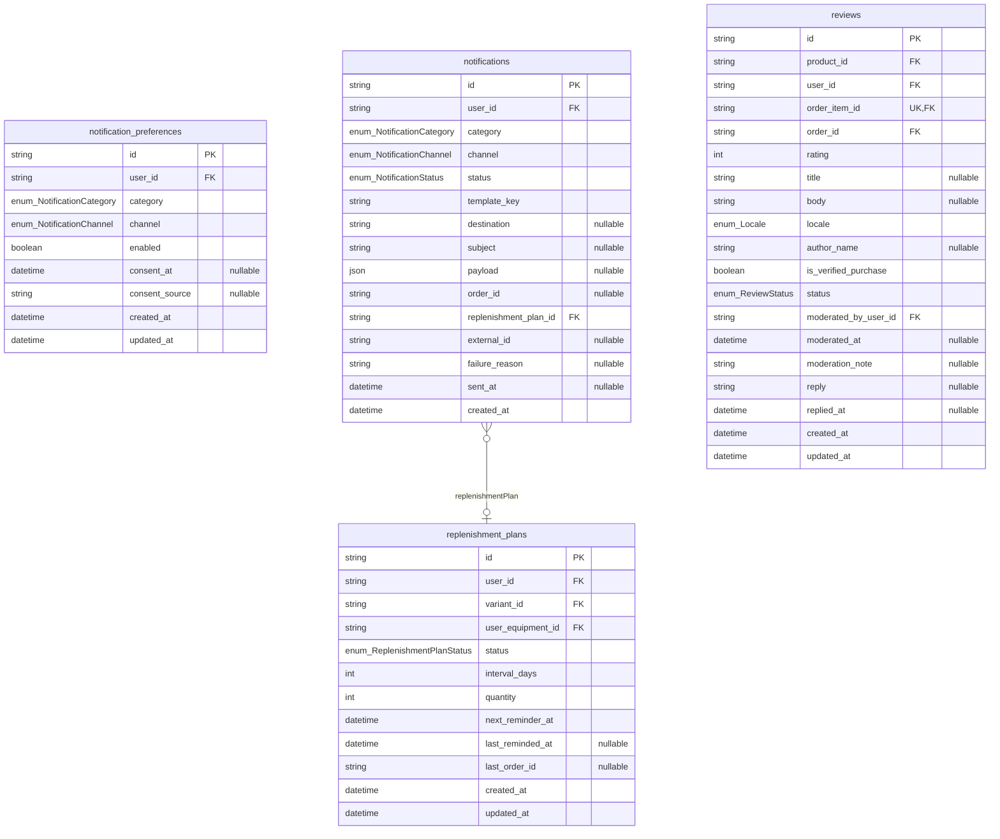
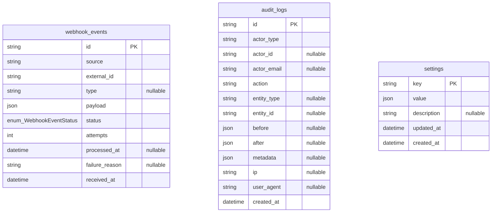

# Diagrammes entité-relation — base de données FFC

> Document GÉNÉRÉ par `pnpm --filter @ffc/api db:erd` — ne pas éditer à la main.
> Un diagramme par domaine fonctionnel ; conventions et décisions dans [database.md](./database.md).

Tables : 44 · Enums : 28

## Comptes et accès

## Catalogue

## Compatibilité équipements et IA

## Fournisseurs

## Ventes

## Expédition

## Rappels, notifications et avis

## Technique

